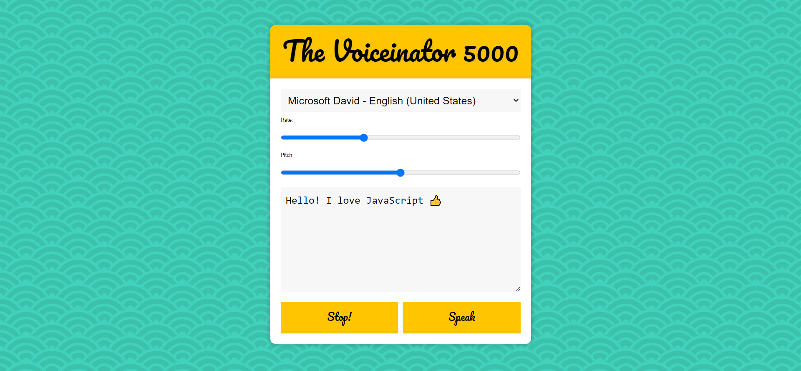

## <h1><u>Voiceinator</u></h1>
## Voiceinator is a tool which is used to read the text in different languages and in various styles of diction.
 
<h3> Features: </h3>
<ol>
    <li>Ability to toggle between multiple voices using the drop down</li>
    <li>Starts speaking when the start button is clicked</li>
    <li>Stops speaking when the stop button is clicked</li>
    <li>Ability to set the pitch and rate</li>
</ol>
 
